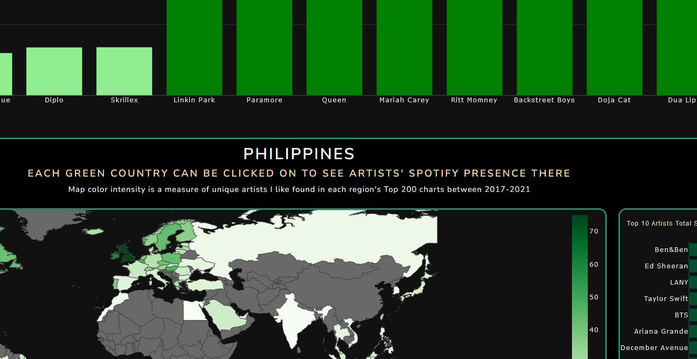

# Spotify Plotly Dash Documentation
  

## Repository Description

This repository contains Python code for creating the dashboard to visualize Spotify charts data. It includes the following files:

* **funcs.py**
Contains functions for data processing and dashboard creation.

* **main.py** 
The main script to run the Plotly Dash application.

* **requirements.txt**
List of necessary Python modules that can be acquired with Pip

## Data Source

The primary dataset used in this project is the 'charts.csv' file, which can be downloaded from Kaggle.

    https://www.kaggle.com/datasets/dhruvildave/spotify-charts/download?datasetVersionNumber=85

This dataset is a 3.48 GB CSV of Spotify chart data for all world regions from Jan2017-Jul2021

## Requirements

To run the Spotify Plotly Dash application, you can install these libraries using pip:

* pandas
* plotly
* dash
* dash_bootstrap_components
* dash_bootstrap_templates

```
pip install pandas plotly dash dash_bootstrap_components dash_bootstrap_templates
```
A more explicit list of modules used in each of these libraries is found in requirements.txt

# Process
1. Download 'charts.csv' from URL to repo directory
2. Generate list of artist name's to be used for filtering chart data.
3. Execute funcs.write_dfs_to_csv() with the list of strings from step 2 as the parameter.
4. Run 'python3 main.py'. This instantiates a Flask server running at local_host on port 8050
5. Visit URL of localhost:8050 on browser of local machine

## Data Dictionary

Datasets listed are created by calling funcs.write_dfs_to_csv after downloading 'charts.csv' from the URL

### personal_artist_list

Any list of artist names that can be read into a Python list. This list is used as a parameter to define the 'my_*.csv' datasets in the function write_dfs_to_csv

### charts200.csv

This dataset is the cleaned up version of the charts.csv downloaded from Kaggle. Streams have been changed from a float to int and the Viral50 chart has been removed 

*    title: String - Song name.
*    rank: Int64 - Artist's position on that date's chart (200-1).
*    date: String - Date in YYYY-MM-DD format.
*    artist: String - Artist names. Multiple artists can appear as comma-delimited strings.
*    url: String - URL link to play the track on Spotify.
*    region: String - Region in which the chart is generated. A 'Global' value is the sum of all regions.
*    chart: String - Chart type, either 'Top200' or 'Viral50'.
*    trend: String - Text description of the movement of the song/title relative to the prior date.
*    streams: Int64 - Total streams of the song on the date.

### world_streams.csv

This dataset summarizes the streams of songs by region and artist. 

*    region: String - Region name.
*    artist: String - Artist name.
*    streams: Int64 - Total streams of songs in that region by the artist.

### my_streams.csv

This dataset summarizes your selected streams by region and artist. 

*    region: String - Region name.
*    artist: String - Artist name.
*    streams: Int64 - Total streams of songs in that region by the artist.

### my_arts.csv

This dataset contains information about your curated list of artists by region. 

*    region: String - Region name.
*    artist: Int64 - Number of artists from your list in that region.
